# Hydraulic_System
State-space realization and simulation of a non-linear hydraulic system in MATLAB and Simulink.


In this project, simulation of a non-linear hydraulic system by designing a **controller** was developed. The system is considered to be single input/single output. The input is the flow of water, and the output is the temprature of the water inside the tank.

The analysis of the **root locus** and **bode diagrams**, and the design of a **lead-lag compensator** are developed in the attached files.
The state equations are also developed in **Simulink blocks**.

By analyzing the function of the controller with different parameters, the system was finalized.

<h2> &nbsp;Hydraulic System Model:</h2>

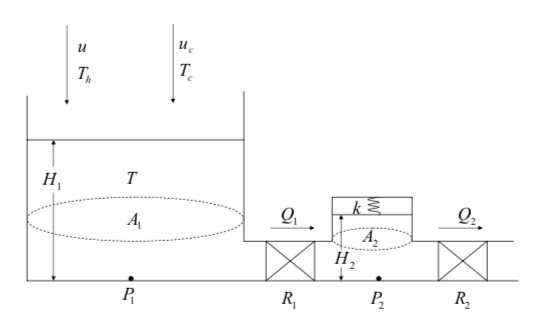

<h2> &nbsp;State Variables:</h2>

H1 = Height of the water in the tank

H2 = Height of the water in the accumulator

P1 = Pressure in the tank

P2 = Pressure in the accumulator

A1 = Cross sectional area of the tank

A2 = Cross sectional area of the accumulator

R1 = Fluid resistor between the tank and the accumulator R2 = Fluid resistor between the accumulator and the outside k = Spring constant of the spring in the accumulator

u = Input volumetric flow rate of the hot water

uc = Input volumetric flow rate of the cold water

Q1 = Volumetric flow rate across the first fluid resistor

Q2 = Volumetric flow rate across the second fluid resistor

Th = Temperature of the input hot water

Tc = Temperature of the input cold water

T = Temperature of the water in the tank

<h2> &nbsp;State-Space Model Derivation:</h2>

The differential equation describing the change of the height of the water in the tank can be written as:

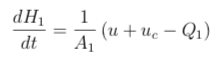

relation between the pressure and the height in the tank:

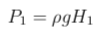

relation between the flow rate across the first fluid resistor and the pressures in the tank and accumulator:

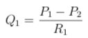

the change of the height of the water in the accumulator is:

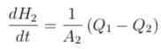

relation between the height of the water in the accumulator and the pressure in the accumulator:

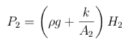

realtion between the pressure in the accumulator and the flow rate across the second fluid resistor:

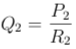

substituting the above two relations in the differential equation for the height of the water in the accumulator:

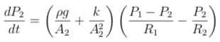

The energy conservation equation of the tank is given by:

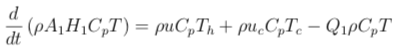

The final equation:

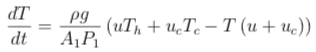

Parameters of the system (all units are SI units):
```
ρ = 1000 kg/m3 g = 9.81 m/s2 H10 = 1 m
H20 = 0.1 m
A1 = 3 m2
A2 = 1 m2
R1 = 100000 m4/Ns
R2 = 150000 m4/Ns
k = 200 Pa
Th =360K
Tc = 280 K
T0=300 K
uc = 0.005 m3/s
```

The state model:

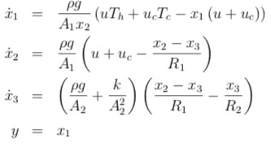

Now we find the **state metrices** from the above equation. Since the system is single-input single-output with one equilibrium point, the **transfer function** of the system can be found from the equation below:

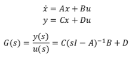

The results in **MATLAB**:

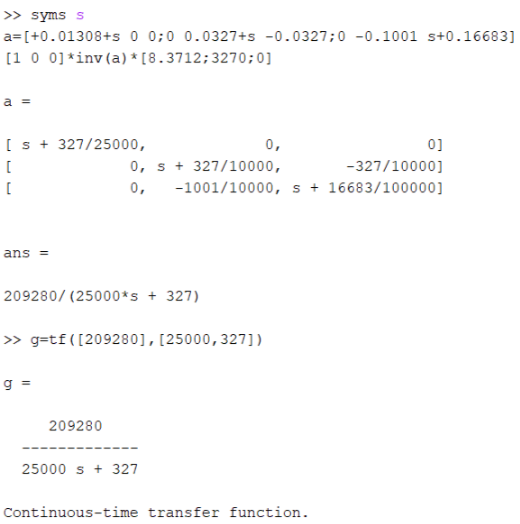

Root Locus graph:

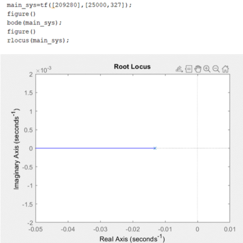

Bode Plot:

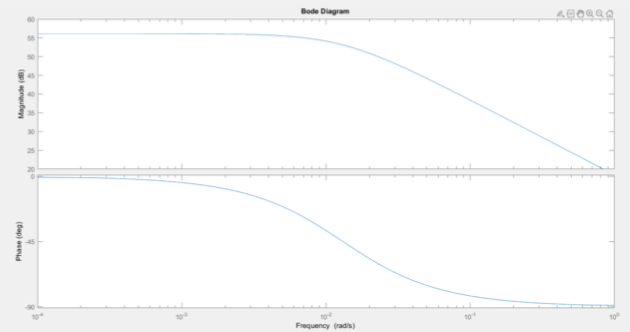

Gain Margin and Phase Margin diagram:

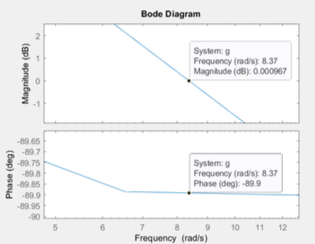

Next, we design a **compensator** and study the rise time and settling time in MATLAB:

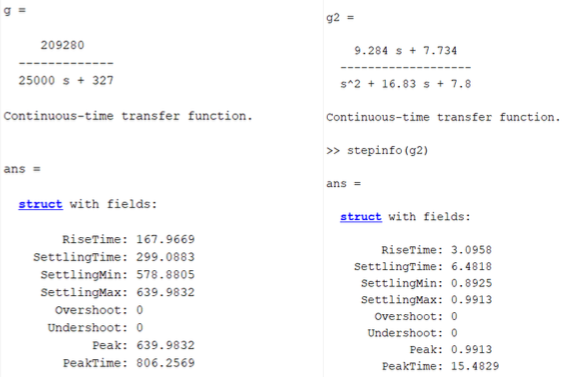

Root Locus graph after applying the compensator:

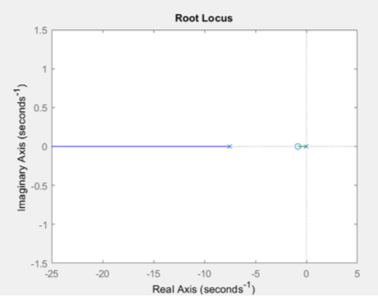

Bode Plot after applying the compensator:

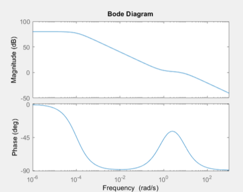

Gain Margin and Phase Margin diagram after applying the compensator:

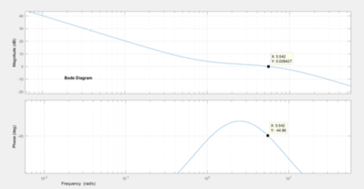

Simulation of the system before applying **turbulence**:

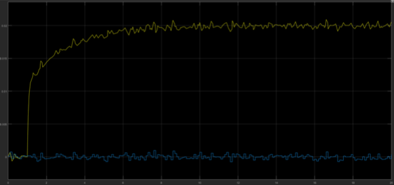

Applying turbulence:

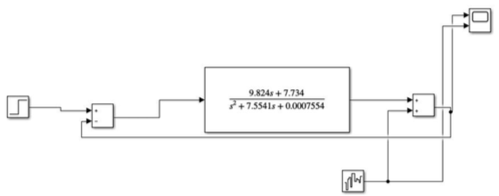

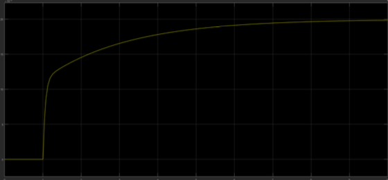

Modeling the nonlinear equations in **Simulink**:

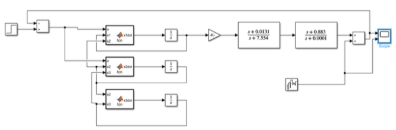

Before and after turbulence:

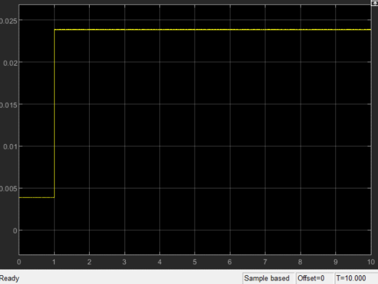

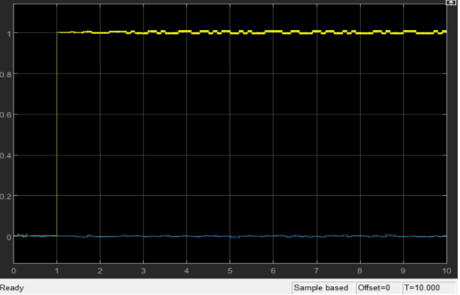

As we see, the function of the controller is acceptable since adding noise to the system didn't change the results much.
